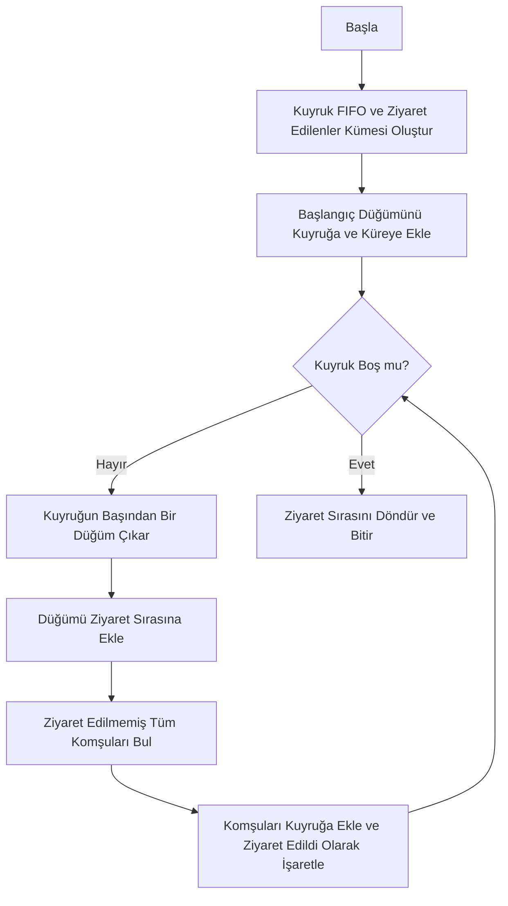
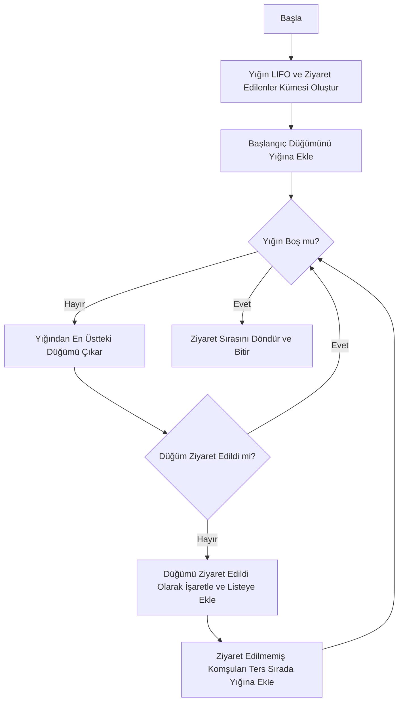
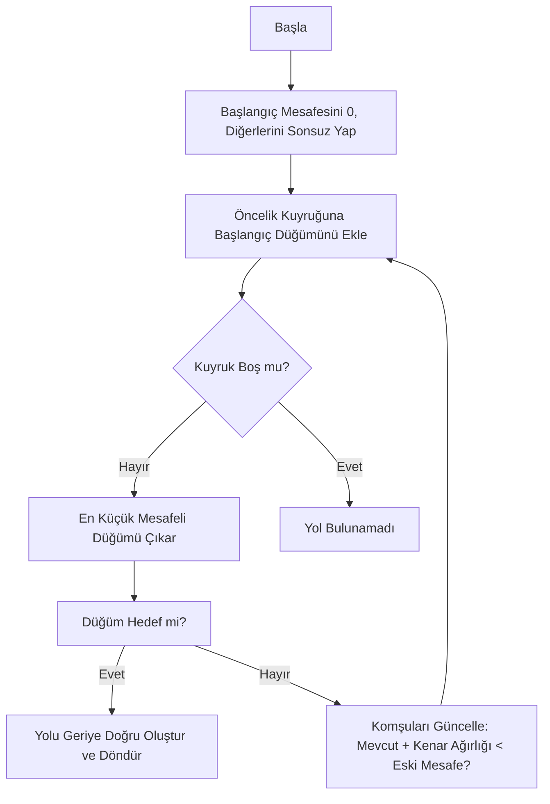
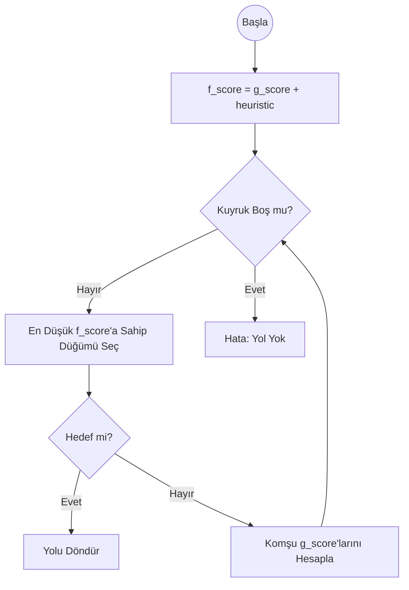

# Üniversite Sosyal Ağ Analizi

Ders: Yazılım Geliştirme Laboratuvarı

Bölüm: Bilişim Sistemleri Mühendisliği


Grup Üyeleri:


* 241307114 Ömer Faruk Güler (GitHub: @farukomerg)


* 131307064 Gülnihal Eruslu (GitHub: @gulni-hal)

---

## 1. Giriş

Günümüzde sosyal ağlar bireyler, kurumlar veya organizasyonlar arasındaki ilişkilerin analiz edilmesi açısından büyük önem taşımaktadır. Bu analiz sayesinde ağ içerisindeki bağlantılar, etkileşim yapıları, topluluklar ve merkezi düğümler belirlenebilir. Graf algoritmaları kullanılarak karmaşık ağ yapıları daha anlaşılır hale getirilir.

Bu projede, **üniversiteler birer düğüm (node)**, üniversiteler arasındaki **akademik iş birlikleri ise kenar (edge)** olarak modellenmiş ve bu yapı bir **graf** üzerinde ele alınmıştır. Geliştirilen uygulama ile graf üzerinde çeşitli algoritmalar çalıştırılarak ağ yapısı analiz edilmiş ve sonuçlar görsel olarak sunulmuştur.

Projenin temel amaçları aşağıda listelenmiştir:

- Graf veri yapısının uygulamalı olarak öğrenilmesi  
- BFS, DFS, Dijkstra, A*, Welsh–Powell gibi temel graf algoritmalarının gerçeklenmesi  
- Nesne yönelimli yazılım mimarisi oluşturulması  
- Görsel ve etkileşimli bir kullanıcı arayüzü geliştirilmesi  
- Algoritma test sonuçlarının görsel ve tablo halinde sunulması  

---
## 2. Nesne Yönelimli Tasarım (OOP)

Projede nesne yönelimli programlama (OOP) prensipleri esas alınmış, soyutlama (abstract) ve arayüzler (interface) kullanılarak her kavram ayrı sınıflar halinde modellenmiştir.

###  Temel Sınıflar

- **Node:**  Her bir üniversiteyi temsil eder. Üniversitenin öğrenci sayısı, kuruluş yılı, bulunduğu il ve ilçe, akademisyen sayısı ve akademik sıralama sayısal özelliklerini içerir.

- **Edge:**  İki üniversite arasındaki akademik iş birliğini temsil eder. Kenar üzerinde dinamik olarak hesaplanan ağırlık (maliyet) bilgisi tutulur.

- **Graph:**  Tüm düğüm ve kenarları yöneten ana sınıftır. Düğüm ve kenar ekleme, silme ve güncelleme işlemleri bu sınıf üzerinden gerçekleştirilir.

- **Algorithm:**  BFS, DFS, Dijkstra ve A* gibi algoritmalar için ortak bir soyut arayüz sağlar.

- **Coloring:**  Welsh–Powell graf renklendirme algoritmasını yöneten sınıftır. Birbirine komşu olan düğümlerin farklı renklerle gösterilmesini sağlar.

---

## 3. Veri Saklama ve Yükleme

Uygulama, verilerin kalıcı olarak saklanabilmesi ve tekrar yüklenebilmesi için **JSON** ve **CSV** formatlarını desteklemektedir.

- **JSON:**  Graf yapısının (düğümler ve kenarlar) kaydedilmesi için kullanılır.

- **CSV:**  Üniversitelere ait sayısal özelliklerin (öğrenci sayısı, üniversite yaşı, sıralama vb.) tutulması ve veri içe/dışa aktarımı için kullanılır.

Veri içe aktarımı sırasında hem JSON hem de CSV dosyaları kullanılarak sisteme yeni node ve edge eklenebilmektedir.

Veri dışa aktarımı işlemlerinde ise CSV formatı kullanılarak hem genel graf yapısı hem de çeşitli algoritmaların ürettiği sonuçlar dosya olarak dışa aktarılabilmektedir.

---

## 4. Dinamik Ağırlık Hesaplama

Üniversiteler arasındaki akademik iş birliği kenarlarının ağırlıkları **dinamik olarak** hesaplanmaktadır. Bu hesaplama üniversitelerin sayısal özellikleri dikkate alınarak yapılır.

Ağırlık hesaplamasında kullanılan özellikler:

- Ai: Üniversitenin **öğrenci sayısı**
- Ei: Üniversitenin **yaşı** (kuruluşundan itibaren geçen yıl sayısı)
- Bi: Üniversitenin **akademik sıralaması**

İki üniversite arasındaki kenar ağırlığı aşağıdaki formül ile hesaplanır:
Agirlik(i,j) = 1 / (1 + (Ai - Aj)² + (Ei - Ej)² + (Bi - Bj)²)

Bu hesaplama sonucunda:

- **Benzer özelliklere sahip üniversiteler** → daha yüksek ağırlık  
- **Farklı özelliklere sahip üniversiteler** → daha düşük ağırlık  

Hesaplanan bu ağırlık değerleri, tüm algoritmalarda **kenar maliyeti** olarak kullanılmaktadır.

---

## 5. Kullanılan Algoritmalar
Bu bölümde uygulama kapsamında kullanılan graf algoritmalarının çalışma mantıkları, kullanılan veri yapıları ve sistem içerisindeki işleyişleri açıklanmaktadır.

### 5.1. BFS (Breadth-First Search)
BFS, grafı katman katman keşfeden bir genişlik öncelikli arama algoritmasıdır. Başlangıç düğümüne en yakın düğümlerden başlayarak, ağ içerisindeki erişilebilir tüm düğümleri sırasıyla ziyaret eder.

**Kullanılan Veri Yapıları:**

- **Kuyruk (Queue – FIFO):**  BFS algoritması, İlk Giren İlk Çıkar (First-In, First-Out) prensibiyle çalışan bir kuyruk yapısı kullanır. Yeni keşfedilen komşu düğümler kuyruğun sonuna eklenir, işlenecek düğüm ise kuyruğun başından alınır.

- **Ziyaret Edilenler Kümesi (Visited Set):**   Algoritmanın aynı düğümü tekrar ziyaret ederek sonsuz döngüye girmesini engellemek için kullanılır. Bir düğüm kuyruğa eklenmeden önce ziyaret edilip edilmediği kontrol edilir.

**Çalışma Mantığı:** Başlangıç düğümü kuyruğa eklenir. Kuyruk boşalana kadar; kuyruğun başındaki düğüm çıkarılır, ziyaret edildi olarak işaretlenir ve bu düğümün henüz ziyaret edilmemiş tüm komşuları kuyruğa eklenir.



### 5.2. DFS (Depth-First Search)

DFS, graf üzerinde **bir daldan mümkün olan en derin noktaya kadar ilerleyen** bir **derinlik öncelikli arama algoritmasıdır**.

**Kullanılan Veri Yapısı:**

- **Yığın (Stack – LIFO):** DFS algoritması, Son Giren İlk Çıkar (Last-In, First-Out) prensibiyle çalışan bir yığın yapısı kullanır. En son eklenen düğüm, bir sonraki adımda ilk ziyaret edilen düğüm olur.

**Çalışma Mantığı:** Başlangıç düğümü yığına eklenir. Yığın boşalana kadar; en üstteki düğüm yığından çıkarılır. Eğer düğüm daha önce ziyaret edilmemişse ziyaret listesine eklenir ve komşuları yığına itilir. Bu yapı, algoritmanın grafın derinliklerine hızlı bir şekilde inmesini sağlar.


### 5.3. Dijkstra Algoritması

Dijkstra algoritması, bir başlangıç düğümünden diğer tüm düğümlere olan **en kısa yolu (en düşük toplam maliyetli yolu)** bulan bir algoritmadır.

**Maliyet Hesaplama:** Uygulamada iki üniversite arasındaki kenar ağırlığı:  
- öğrenci sayısı,  
- akademik sıralama,  
- kuruluş yılı farkları  

göz önünde bulundurularak dinamik olarak hesaplanmaktadır.

**Çalışma Mantığı:** Algoritma başlangıçta tüm düğümlere olan mesafeyi sonsuz kabul eder. Bir **Öncelik Kuyruğu (Priority Queue)** kullanılarak her adımda mevcut en düşük maliyetli düğüm seçilir. Seçilen düğüm üzerinden komşu düğümlerin mesafeleri güncellenir.




### 5.4. A* (A-Star) Algoritması

A* algoritması, Dijkstra algoritmasının **hedef odaklı** ve daha verimli bir versiyonudur.

**Genel Mantık:** A* algoritması yalnızca başlangıçtan mevcut düğüme kadar olan maliyeti ($g$ skoru) değil, aynı zamanda hedef düğüme olan **tahmini mesafeyi** ($h$ skoru – heuristic) de hesaba katar.

**Sezgisel (Heuristic) Yaklaşım:** Bu projede sezgisel değer olarak, iki düğümün canvas üzerindeki koordinatları arasındaki **Öklid Mesafesi** kullanılmıştır. Bu sayede algoritma, hedefe fiziksel olarak daha yakın düğümlere öncelik vererek arama alanını daraltır ve çoğu durumda Dijkstra algoritmasına kıyasla daha hızlı sonuç üretir.




### 5.5. Welsh–Powell Algoritması (Graf Renklendirme)

Welsh–Powell algoritması, grafı **komşu düğümler farklı renklerde olacak şekilde**, mümkün olan **en az sayıda renk** kullanarak boyamayı amaçlayan bir graf renklendirme algoritmasıdır.

**Çalışma Mantığı:** Öncelikle düğümler, bağlantı sayılarına (derecelerine) göre **azalan sırada** sıralanır. En yüksek dereceli düğümden başlanarak, komşularının o ana kadar kullanmadığı **en küçük renk numarası** atanır. Bu işlem tüm düğümler renklendirilene kadar devam eder.

Bu algoritma sayesinde graf içerisindeki ayrık topluluklar görsel olarak kolayca ayırt edilebilmektedir.
```mermaid
graph TD
    A[Başla] --> B[Düğümleri Derecelerine Göre Azalan Sırada Diz]
    B --> C{Tüm Düğümler Boyandı mı?}
    C -- Hayır --> D[Boyanmamış En Yüksek Dereceli Düğümü Seç]
    D --> E[Komşularının Kullanmadığı En Küçük Renk ID'sini Ata]
    E --> C
    C -- Evet --> F[Renklendirme Sözlüğünü Döndür]
    F --> G[Bitiş]
 ```

### 5.6 Ayrık Topluluk (Bağlı Bileşen) Analizi

Ayrık topluluk analizi, graf içerisindeki **birbirleriyle doğrudan veya dolaylı olarak bağlantısı olmayan alt ağları** tespit etmek amacıyla kullanılır. Bu analiz sayesinde grafın kaç farklı bağımsız bileşenden oluştuğu belirlenir.

Her ayrık topluluk, kendi içerisinde bağlantılı düğümlerden oluşurken diğer topluluklarla herhangi bir bağlantıya sahip değildir. Bu durum, ağ yapısındaki kopuklukların, izole grupların veya bağımsız alt sistemlerin analiz edilmesine olanak tanır. Elde edilen sonuçlar, graf üzerinde görsel olarak ayrık gruplar halinde gösterilerek kullanıcıya sunulur.

---

### 5.7 Degree Centrality (Derece Merkeziliği)

Degree Centrality, bir düğümün graf içerisindeki **doğrudan bağlantı sayısını** ölçen temel merkezilik metriklerinden biridir. Bir düğümün derece değeri ne kadar yüksekse, ağ içerisindeki etkileşim düzeyi ve önemi de o kadar yüksek kabul edilir.

Bu projede her düğümün sahip olduğu bağlantı sayısı hesaplanmakta ve **en yüksek dereceye sahip ilk 5 düğüm** tablo halinde kullanıcıya gösterilmektedir. Bu analiz sayesinde ağ içerisindeki en etkili, en fazla bağlantıya sahip ve merkezi konumda bulunan düğümler kolaylıkla tespit edilebilmektedir.

    
---
## 6. Kullanıcı Arayüzü

Uygulama kullanıcı dostu ve etkileşimli bir arayüze sahiptir:

- **Sol Panel:**  
  - Algoritmaları çalıştırmak için butonlar  
  - Tüm grafın çıktı alınabildiği alan  
  - Düğüm ve kenar ekleme, silme, güncelleme işlemleri  
  - CSV / JSON veri içe ve dışa aktarma bölümü  

- **Orta Panel:**  
  - Grafın canvas üzerinde görsel gösterimi  
  - Düğümler üniversiteleri, kenarlar akademik iş birliklerini temsil eder  
  - Kenarların üzerinde iki üniversite arasındaki ağırlık değeri gösterilir  

- **Sağ Panel:**  
  - Bilgi paneli  
  - Herhangi bir düğüm veya kenara tıklandığında ilgili detaylar görüntülenir  
  - Seçilen öğe için düzenleme ve silme işlemleri yapılabilir  

---

## 7. Testler ve Performans Analizi

- Küçük ölçekli (10–20 düğüm) ve orta ölçekli (50–100 düğüm) graflar oluşturulmuştur. Test sonuçları aşağıdaki tablolarda gösterilmiştir.
- Tüm algoritmalar bu graflar üzerinde test edilmiştir.
- Algoritmalar makul sürelerde çalışmakta ve sonuçlar tablo halinde raporlanmaktadır.
- Hatalı veri girişleri (aynı sıralamaya sahip üniversitenin tekrar eklenmesi, eksik bilgi girimi, self-loop vb.) sistem tarafından engellenmiştir.

---

## 8.  Kullanılan Teknolojiler

- **Python 3.10**  Projenin geliştirildiği temel programlama dili.

- **PyQt5**  Grafik kullanıcı arayüzünün (GUI) oluşturulması ve etkileşimli bileşenlerin yönetimi.

- **SQLite**  Üniversite düğümleri ve aralarındaki ilişkilerin kalıcı olarak saklandığı hafif veritabanı sistemi.

- **QPainter & Canvas**  Graf yapısının, düğümlerin, kenarların ve görsel animasyonların dinamik olarak çizilmesi.

- **NetworkX**  Düğümlerin ekran üzerindeki yerleşim düzeninin (spring layout) hesaplanması ve graf düzeninin iyileştirilmesi.

- **JSON & CSV**  Veri içe/dışa aktarımı, komşuluk listelerinin raporlanması ve kalıcı veri saklama işlemleri.

- **PyCharm**  Proje geliştirme, kod düzenleme ve hata ayıklama süreçlerinde kullanılan entegre geliştirme ortamı (IDE).

## 9. Sonuç ve Tartışma

Bu proje kapsamında, üniversiteler arası akademik ilişkiler graf veri yapısı üzerinde başarıyla modellenmiş ve analiz edilmiştir. Dinamik ağırlık hesaplamaları sayesinde, özellik bakımından birbirine daha yakın üniversiteler görsel olarak daha ilişkili şekilde gösterilebilmekte, kullanıcılar bu yakınlıkları grafik üzerinde doğrudan gözlemleyebilmektedir. Ayrıca uygulanan graf algoritmaları sayesinde, üniversitelerin birbirleriyle olan ilişkileri farklı senaryolar altında test edilebilmekte ve ağ yapısı detaylı olarak analiz edilebilmektedir.

---

## 10. Olası Geliştirmeler

- Daha fazla üniversite eklenerek daha büyük ölçekli bir ağ analizi gerçekleştirilmesi
- Farklı ülkelerden üniversitelerin dahil edilerek uluslararası akademik ağların analiz edilmesi
- Yönlü graf desteği ile iş birliklerinin tek yönlü modellenebilmesi
- Programın bilgisayara kurulmasına gerek kalmadan, herkesin bir internet sitesi üzerinden kullanabileceği bir web sürümü  


---
## 11. Kaynakça
